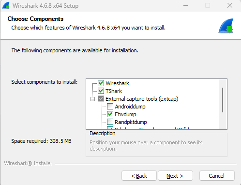
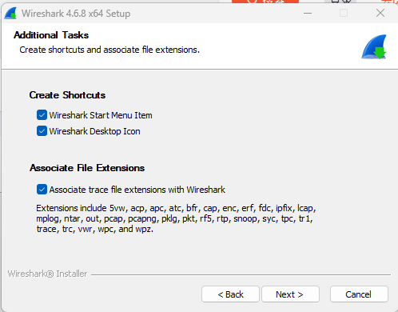
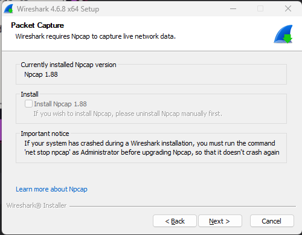
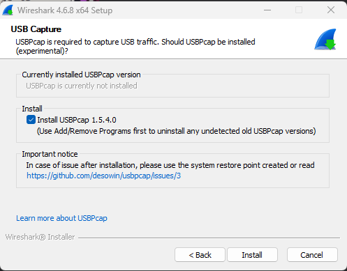
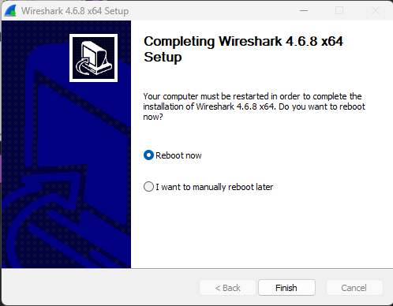
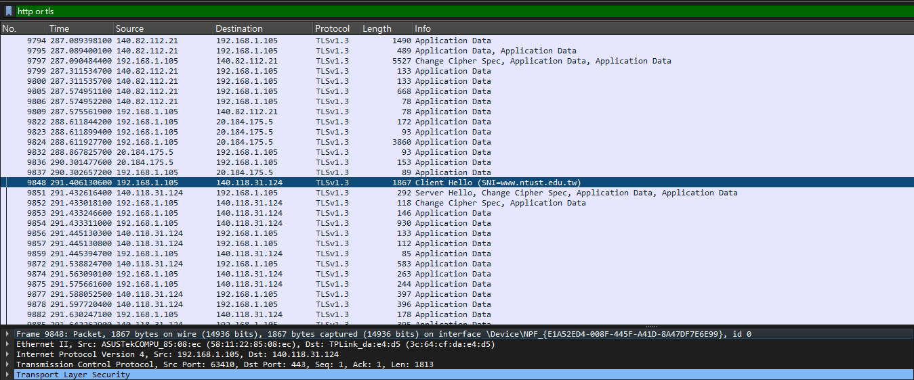
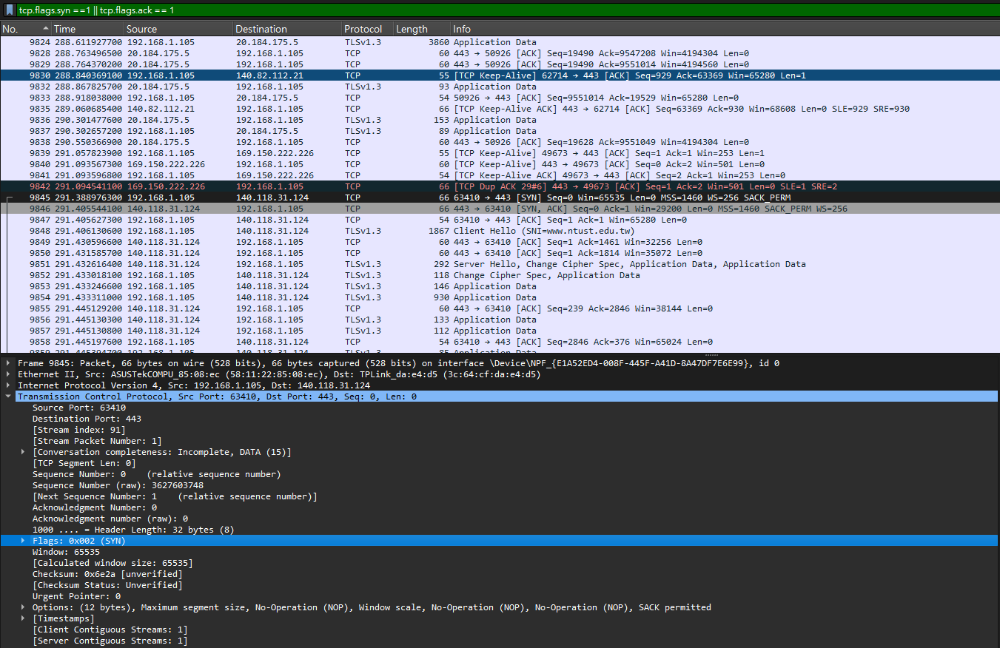
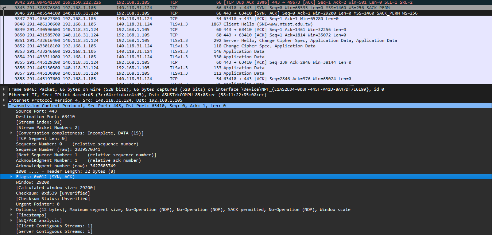
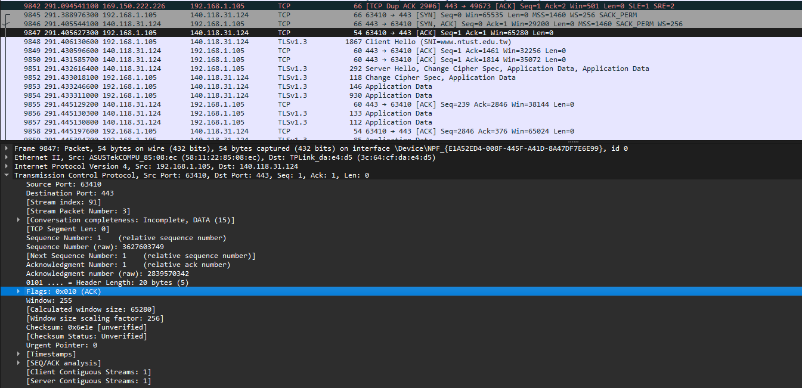

# Lab 0: Basic wireshark operation and capture
- [Lab 0: Basic wireshark operation and capture](#lab-0-basic-wireshark-operation-and-capture)
  - [1.Wireshark Installation Guide (Windows)](#1wireshark-installation-guide-windows)
  - [2. Capture packets: access the NTUST homepage (https://www.ntust.edu.tw/home.php)](#2-capture-packets-access-the-ntust-homepage-httpswwwntustedutwhomephp)
    - [2.1 Q: What is the IP address and port of the NTUST homepage (https://www.ntust.edu.tw/home.php)?](#21-q-what-is-the-ip-address-and-port-of-the-ntust-homepage-httpswwwntustedutwhomephp)
    - [2.2 Q: What is the IP address and port of your PC when initially accessing the page?](#22-q-what-is-the-ip-address-and-port-of-your-pc-when-initially-accessing-the-page)
    - [2.3 What is the process of the TCP three-way handshake?](#23-what-is-the-process-of-the-tcp-three-way-handshake)

## 1.Wireshark Installation Guide (Windows)
Go to [wireshark website](https://www.wireshark.org/download.html) and choose version to download 

Choose Components you want to install\

Creat the icon in desktop\

Install Npcap (In this PC is already have)\

Install USBPcap and wireshark\

Reboot PC\

## 2. Capture packets: access the NTUST homepage (https://www.ntust.edu.tw/home.php)

### 2.1 Q: What is the IP address and port of the NTUST homepage (https://www.ntust.edu.tw/home.php)?

- A: IP adress is `140.118.31.124` ,port is `443` (from Dst Port).

### 2.2 Q: What is the IP address and port of your PC when initially accessing the page?

- A: IP adress is `192.168.1.105`, port is `63410` (from Src Port).

### 2.3 What is the process of the TCP three-way handshake?
- SYN: Client sends SYN to server.\

- SYN-ACK: Server replies with SYN-ACK.\

- ACK: Client sends ACK. Connection established.\
