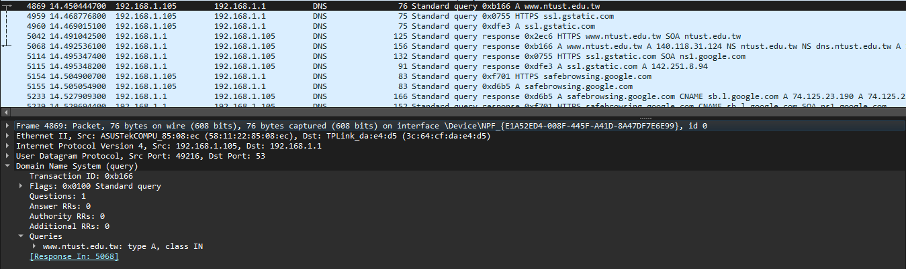
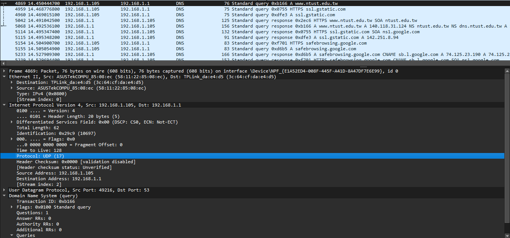
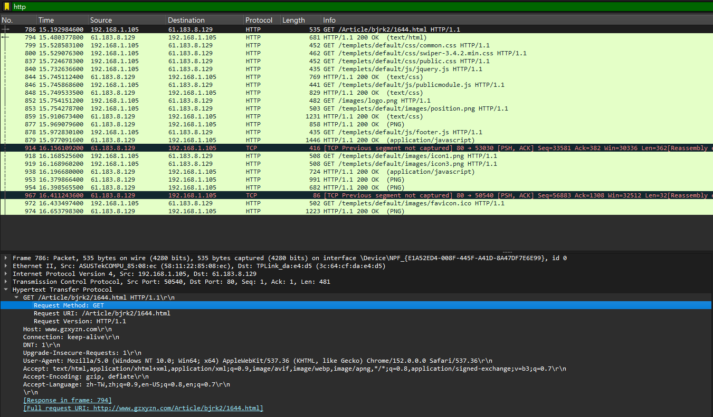
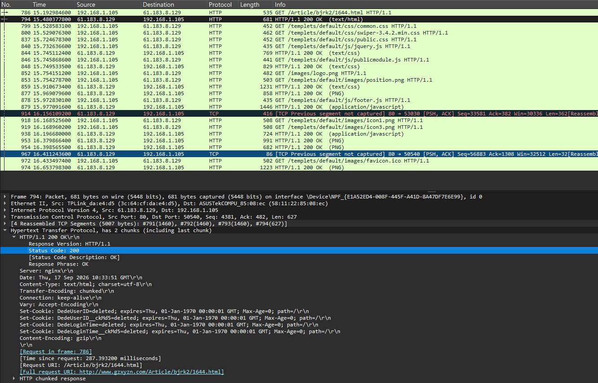

# Lab 0: Basic wireshark operation and capture
- [Lab 0: Basic wireshark operation and capture](#lab-0-basic-wireshark-operation-and-capture)
  - [1.Wireshark Installation Guide (Windows)](#1wireshark-installation-guide-windows)
  - [2. Capture packets: access the NTUST homepage (https://www.ntust.edu.tw/home.php)](#2-capture-packets-access-the-ntust-homepage-httpswwwntustedutwhomephp)
    - [2.1 Q: What is the IP address and port of the NTUST homepage (https://www.ntust.edu.tw/home.php)?](#21-q-what-is-the-ip-address-and-port-of-the-ntust-homepage-httpswwwntustedutwhomephp)
    - [2.2 Q: What is the IP address and port of your PC when initially accessing the page?](#22-q-what-is-the-ip-address-and-port-of-your-pc-when-initially-accessing-the-page)
    - [2.3 What is the process of the TCP three-way handshake?](#23-what-is-the-process-of-the-tcp-three-way-handshake)
  - [3. Use the filter dns to find a DNS packet](#3-use-the-filter-dns-to-find-a-dns-packet)
    - [3.1 What is the IP address and port of the DNS server?](#31-what-is-the-ip-address-and-port-of-the-dns-server)
    - [3.2 What is the domain name in this query?](#32-what-is-the-domain-name-in-this-query)
    - [3.3 Which protocol(s) does this DNS packet use? (List the protocols from Layer 2 — Link Layer — up to Layer 5 — Application Layer in the TCP/IP five-layer model.)](#33-which-protocols-does-this-dns-packet-use-list-the-protocols-from-layer-2--link-layer--up-to-layer-5--application-layer-in-the-tcpip-five-layer-model)
  - [4. Access an HTTP page and answer the following questions:](#4-access-an-http-page-and-answer-the-following-questions)
    - [4.1 Which HTTP page did you access?](#41-which-http-page-did-you-access)
    - [4.2 What is the IP address and port of the server hosting this page?](#42-what-is-the-ip-address-and-port-of-the-server-hosting-this-page)
    - [4.3 What is the request method?](#43-what-is-the-request-method)
    - [4.4 What is the response status code, and what does it mean?](#44-what-is-the-response-status-code-and-what-does-it-mean)

## 1.Wireshark Installation Guide (Windows)
Go to [wireshark website](https://www.wireshark.org/download.html) and choose version to download 

Choose Components you want to install\


Creat the icon in desktop\


Install Npcap (In this PC is already have)\


Install USBPcap and wireshark\


Reboot PC\


## 2. Capture packets: access the NTUST homepage (https://www.ntust.edu.tw/home.php)


### 2.1 Q: What is the IP address and port of the NTUST homepage (https://www.ntust.edu.tw/home.php)?

- A: IP adress is `140.118.31.124`, port is `443` (from Dst Port).

### 2.2 Q: What is the IP address and port of your PC when initially accessing the page?

- A: IP adress is `192.168.1.105`, port is `63410` (from Src Port).

### 2.3 What is the process of the TCP three-way handshake?
- SYN: Client sends SYN to server.\


- SYN-ACK: Server replies with SYN-ACK.\


- ACK: Client sends ACK. Connection established.\


## 3. Use the filter dns to find a DNS packet

Interestingly, if you use Brave as your browser, you might not be able to catch `dns` packets because of its default settings.\


### 3.1 What is the IP address and port of the DNS server?
- IP adress is `192.168.1.1`, port is `53` (from Dst Port).

### 3.2 What is the domain name in this query?

- The domain name in the query is [www.ntust.edu.tw](https://www.ntust.edu.tw/)

### 3.3 Which protocol(s) does this DNS packet use? (List the protocols from Layer 2 — Link Layer — up to Layer 5 — Application Layer in the TCP/IP five-layer model.)



- Layer 2 (Link Layer): Ethernet II
- Layer 3 (Network Layer): Internet Protocol Version 4 (IPv4)
- Layer 4 (Transport Layer): User Datagram Protocol (UDP)
- Layer 5 (Application Layer): Domain Name System (DNS)

## 4. Access an HTTP page and answer the following questions:

### 4.1 Which HTTP page did you access?
- http://www.gzxyzn.com/Article/bjrk2/1644.html

### 4.2 What is the IP address and port of the server hosting this page?



- IP adress: `61.183.8.129`, port is 80 (from Dst Port).
### 4.3 What is the request method?
- GET
### 4.4 What is the response status code, and what does it mean?


- As we can see, a lot of packet showing that
```
HTTP/1.1 200 OK
```
The number of 200 is the `response status code`.

More explaination of `response status code` can see here [[Link]](https://developer.mozilla.org/en-US/docs/Web/HTTP/Reference/Status).